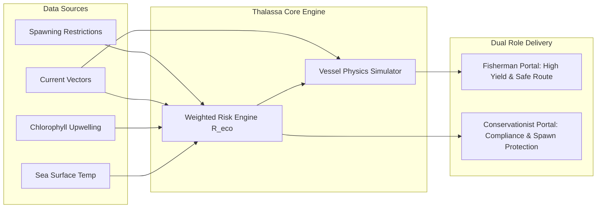

# Thalassa (MatsyaDrishti) Project: Innovation & Architecture Review

This document evaluates the technological innovation, UX strategy, and system architecture of the **Thalassa (MatsyaDrishti)** platform. 

---

## 1. Executive Innovation Summary

Thalassa represents a significant shift in marine spatial planning and maritime navigation. Rather than treating ecological conservation and commercial fishing as opposing forces, the platform integrates them into a unified **digital twin interactive space**. By synthesizing real-time ocean physics (current vectors, Sea Surface Temperature (SST), and Chlorophyll concentrations) with regulatory marine protected areas, Thalassa acts as a dual-purpose decision support system.

---

## 2. Key Technological Innovations

### A. Dynamic Weighted Ecological Risk Synthesis ($R_{\text{eco}}$)
Most marine mapping tools rely on static boundaries. Thalassa’s innovation lies in its **live-weighted risk scoring system**:
$$R_{\text{eco}} = 0.30 \cdot E_{\text{risk}} + 0.25 \cdot B_{\text{risk}} + 0.20 \cdot O_{\text{risk}} + 0.15 \cdot A_{\text{risk}} + 0.10 \cdot V_{\text{risk}}$$
* **Why it's innovative:** It translates complex, multi-layered ecological conditions (benthic health index, upwelling temperatures, wind stress, vessel densities) into a single actionable index. 
* **Real-world utility:** If spawning stress rises or temperature anomalies are detected, the system dynamically scales up warnings and shifts active buffer zones, allowing authorities to deploy reactive conservation policies instead of static calendar-based bans.

### B. Dual-Perspective Role Design (Bridging the Gap)
The platform offers a zero-friction toggle between two user modes:
1. **Fisherman Mode:** Optimizes catch rates by locating upwelling zones (where Chlorophyll and thermal fronts align) while plotting routes that minimize fuel burn.
2. **Conservationist Mode:** Focuses on spawning sanctuary integrity, tracking compliance rates, and analyzing spatial disturbance thresholds.
* **Why it's innovative:** By sharing the same physical map grid but changing the informational layers, it ensures both fishermen and regulators operate from a **single source of truth**, fostering collaborative resource management.

### C. Physics-Based Eco-Transit Simulation
The integrated vessel simulator does not just trace lines on a map; it calculates physical drag, fuel consumption rates, and estimated carbon emissions relative to current velocity vectors and wave drag coefficients.
* **Why it's innovative:** It shows fishermen the immediate economic benefit of compliance. Plotted routes that navigate around spawning bans are verified to leverage favorable currents, proving that green routes can also be fuel-efficient routes.

---

## 3. UI/UX Design Innovation

The dark glassmorphic midnight console style represents a departure from traditional white-backed, form-heavy GIS interfaces:
* **Tactile Dark Theme:** The deep midnight canvas (`#0a151a`) and semi-transparent deep-teal glass wrappers (`rgba(24, 61, 61, 0.6)`) minimize eye strain for fishermen operating vessels at night.
* **Spotlight Glow Interactions:** Using cursor coordinates to cast dynamic spotlight gradients (`rgba(166, 207, 190, 0.15)`) behind telemetry cards provides high visual feedback, drawing the user’s eye to active data points.
* **Micro-Animations:** Incorporating a pulsing brand indicator and outlined play-state transitions creates a responsive environment that feels "alive" and synchronized with incoming telemetry.

---

## 4. Architectural Strengths & Recommendations

### Current Strengths
* **Decoupled canvas rendering:** Leaflet layers are rendered efficiently without blocking main-thread calculations.
* **CSS Variable Driven:** The mapping of variables ensures theme-switching and color-updates occur globally without refactoring component code.

### Future Scalability Recommendations
> [!TIP]
> **Dynamic Machine Learning Predictors:** By capturing historical upwelling and SST fronts, the Matsya Engine can be expanded to predict upwelling location shifts 48 hours in advance.

> [!NOTE]
> **Glider & Drone Integration:** The Supabase realtime channels are perfectly structured to ingest live telemetry from autonomous wave gliders or drone buoys directly into the risk engine.
